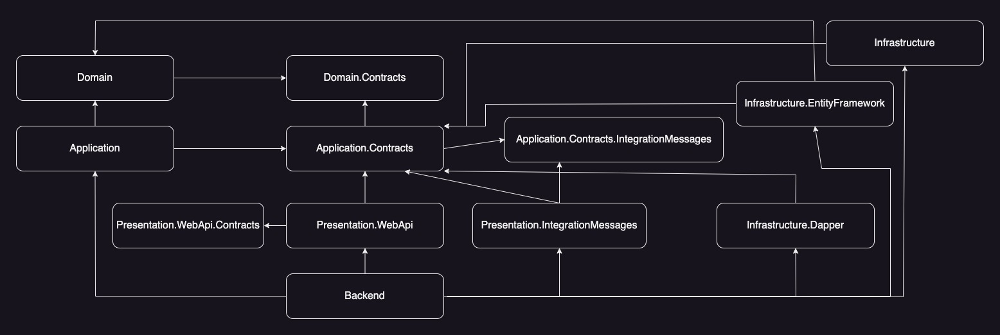

What is the SharedKernel Project?
=====================
The goal of this project is create the building blocks to follow DDD principles and Clean Architecture in .NET

# Give it a star ⭐

Loving it? Please show your support by giving this project a star!

## NuGets ready to use: ⚙️

- 

- 

- 

- 

- 

## Dependency graph: 👨‍💻

## How to debug: 🐛

- You will need the latest Visual Studio 2022 and the latest .NET Core SDK (at least .NET 8 SDK)
- All the projects library are contained in JordiAragonZaragoza.SharedKernel.sln solution file.

## Used libraries: ⚒️

- MediatR
- AutoMapper
- Autofac
- MassTransit
- FastEndpoints
- Ardalis.Result
- Ardalis.Specification
- Ardalis.SmartEnums
- Ardalis.GuardClauses
- FluentValidator
- Serilog
- Quartz
- Refit
- EasyCaching
- Volo.Abp.Guids Generator
- StyleCop & SonarAnalyzer

## Brief explanation per project (Pending to complete) 🤓

**SharedKernel and Contracts**
- Dependency Injection. Allow auto register services using markup interfaces.

**Domain and Contracts**
- Common contracts and base implementations to flow DDD principles like: DomainEvents, ApplicationEvents, ValueObjects, Entities, Repository, BusinessRulesValidations and other DDD building blocks.

**Application and Contracts**
- Application common contracts and base implementation for EventBus, UnitOfWork and CQRS...
- Common MediatR pipelines implementation 
- IntegrationMessages contacts and base implementation to be used in EventBus
- Common EventBus implementation using MassTransit

**Infrastructure and Contracts**
- EntityFramework base implementation to allow auditing and outbox to dispatch domain events notifications. 
- BaseCachedRepository is done using ICacheService abstraction.
- MassTransitEventBus base implementation.

**Presentation and Contracts**
- HttpRestfulApi building blocks. Like BaseApiController, ExceptionMiddleware, CurrentUserService and ResponseBuilder for ProblemDetails.

## Testing 🧪

GitHub workflow CI with SonarCloud integration

## Resources and Inspiration 🙏

Special thanks to all these authors for sharing their knowledge and expertise:

- <a href="https://github.com/ardalis/CleanArchitecture" target="_blank">Ardalis: Clean Architecture</a>
- <a href="https://github.com/jasontaylordev/CleanArchitecture" target="_blank">Jason Taylor: Clean Architecture</a>
- <a href="https://www.oreilly.com/library/view/implementing-domain-driven-design/9780133039900/" target="_blank">Vaughn Vernon: Implementing Domain-Driven Design (book)</a>
- <a href="https://kalele.io/books/ddd-destilado/" target="_blank">Vaughn Vernon: Domain-Driven Design Destilado (book)</a>
- <a href="https://www.amazon.com/Hands-Domain-Driven-Design-NET-ebook/dp/B07C5WSR9B" target="_blank">Alexey Zimarev: Hands-on Domain-Driven Design (book)</a>
- <a href="https://github.com/dotnet-architecture/eShopOnContainers" target="_blank">Microsoft eShopOnContainers</a>
- <a href="https://github.com/dotnet-architecture/eShopOnWeb" target="_blank">Microsoft eShopOnWeb</a>
- <a href="https://github.com/kgrzybek/sample-dotnet-core-cqrs-api" target="_blank">Kamil Grzybek: Sample .NET Core REST API CQRS</a>
- <a href="https://github.com/kgrzybek/modular-monolith-with-ddd" target="_blank">Kamil Grzybek: Modular Monolith With DDD</a>
- <a href="https://github.com/oskardudycz/EventSourcing.NetCore" target="_blank">Oskar Dudycz: EventSourcing .NET</a>
- <a href="https://www.youtube.com/watch?v=26xrX113KZc" target="_blank">Explore DDD: Mauro Servienti - Talk Session: Welcome to the (State) Machine</a>
- <a href="https://www.youtube.com/watch?v=KkzvQSuYd5I" target="_blank">Explore DDD: Mauro Servienti - Talk Session: All Our Aggregates Are Wrong</a>
- <a href="https://www.youtube.com/watch?v=Lw04HRF8ies" target="_blank">NDC Oslo: Udi Dahan - Talk Session: CQRS pitfalls and patterns</a>
- <a href="https://www.confluent.io/events/kafka-summit-london-2024/event-modeling-anti-patterns/" target="_blank">KS2024: Oskar Dudycz - Talk Session: Event Modeling Anti-patterns</a>
- <a href="https://www.youtube.com/watch?v=kPV1SkdSnhE" target="_blank">Vladimir Khorikov: DDD in a nutshell</a>
- <a href="https://odysee.com/@sunnyAtticSoftware:a?view=content" target="_blank">Diego Martin: SunnyAttic Software Videos</a>
- <a href="https://www.youtube.com/watch?v=SUiWfhAhgQw" target="_blank">Jimmy Bogard: Vertical Slice Architecture</a>
- <a href="https://www.youtube.com/@CodeOpinion" target="_blank">CodeOpinion: Youtube Channel</a>
- <a href="https://www.youtube.com/@amantinband" target="_blank">Amichai Mantinband: Youtube Channel</a>
- <a href="https://www.youtube.com/@MilanJovanovicTech" target="_blank">Milan Jovanović: Youtube Channel</a>

## Versions

The main branch is now on .NET 8 The following previous versions are available:
* [.NET 7](https://github.com/jordiaragonzaragoza/JordiAragonZaragoza.SharedKernel/tree/net7.0)

## About: 🧐

The SharedKernel Project was developed by <a href="https://www.linkedin.com/in/jordiaragonzaragoza/" target="_blank">Jordi Aragón Zaragoza</a>

## License: 👮‍♂️

[Creative Commons Attribution-NonCommercial-NoDerivatives 4.0 International License](http://creativecommons.org/licenses/by-nc-nd/4.0/).

